# Express-Library-Api

# Description

A simple RESTful API built with **Node.js** and **TypeScript** and **Express JS** for managing a book library.  
Supports CRUD operations (Create, Read, Update, Delete) for both **Authors** and **Books** with JSON data.

# Table of Contents

- [Installation](#installation)
- [Usage](#usage)
- [API Endpoints](#api-endpoints)
- [Scripts](#scripts)
- [Project Structure](#project-structure)
- [Technologies](#technologies)
- [License](#license)

# Installation

1. Clone the repository

   ```bash
   git clone https://github.com/Karabo2002dev/express-library-api.git
   cd express-library-api
   code .

   ```

2. Install dependencies
   ```bash
   git checkout dev
   npm install
   ```

# Usage

1. Run Project
   ```bash
   npm run dev
   ```
---

2. API Endpoints

- NB use https://www.postman.com/ for endpoint testing

- http://localhost:3000 or prefered port able to change on [server.ts]

## Authors endpoints

### Get all authors

`GET /authors`

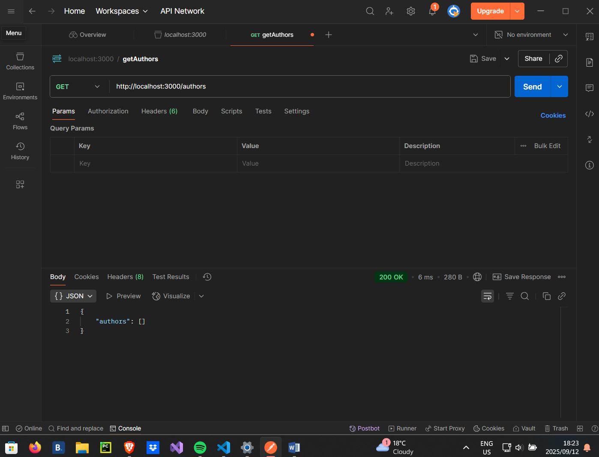

### Get single author

`GET /authors/id`

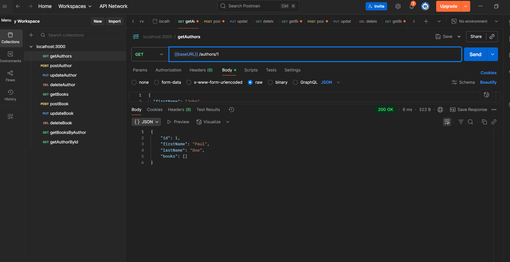

### Add new author

`POST /authors`

**Request body:**

```json
{
  "firstName": "Lebo",
  "lastName": "Kgaphola"
}
```
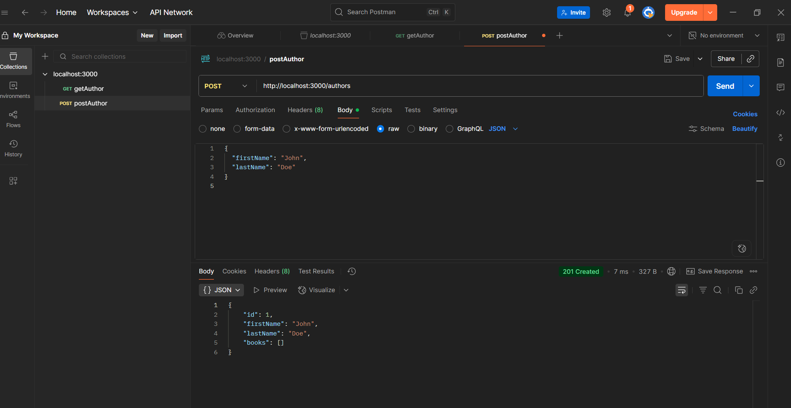


### Update author

`PUT /authors/id`

**Request body:**

```json
{
  "firstName": "Paul",
  "lastName": "Doe"
}
```
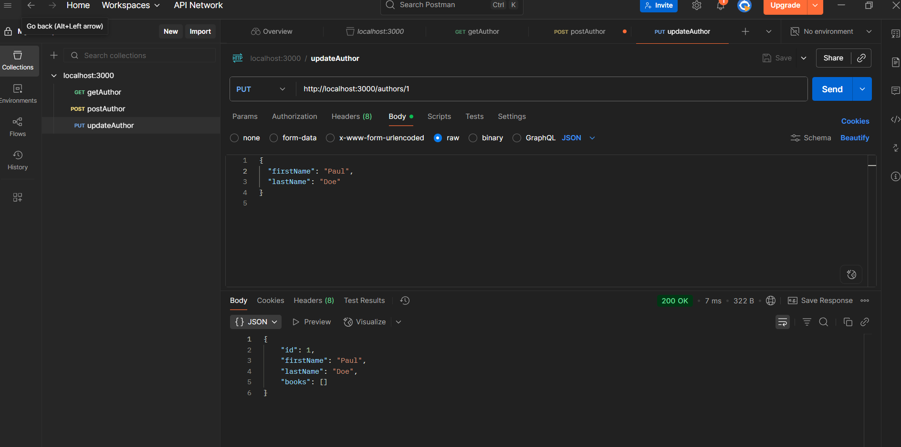


### Delete author

`DELETE /authors/id`

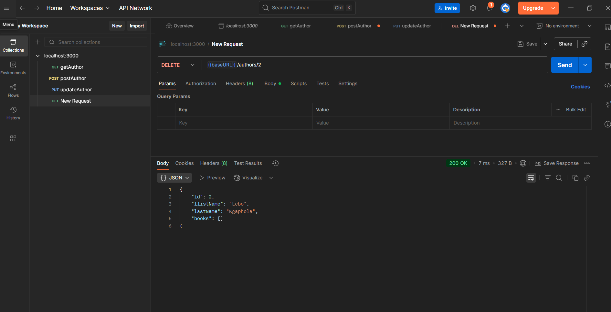


## Books endpoints

### Get all books

`GET /books`

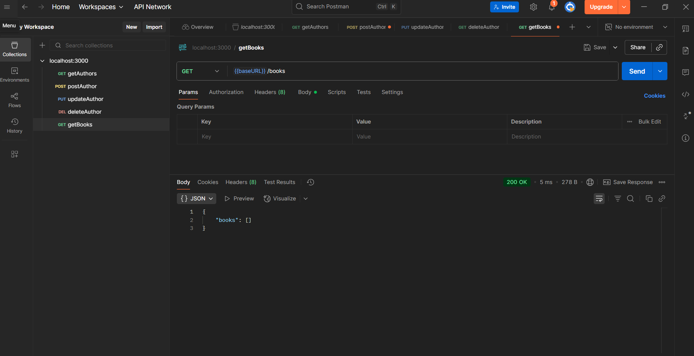

### Get single book

`GET /books/id`

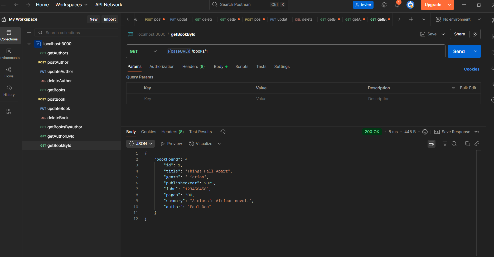

### Add new author

`POST /books`

**Request body:**

```json
{
  "title": "Things Fall Apart",
  "genre": "Fiction",
  "publishedYear": 2025,
  "authorId": 1,
  "isbn": "123456456",
  "pages": 300,
  "summary": "A classic African novel."
}
```
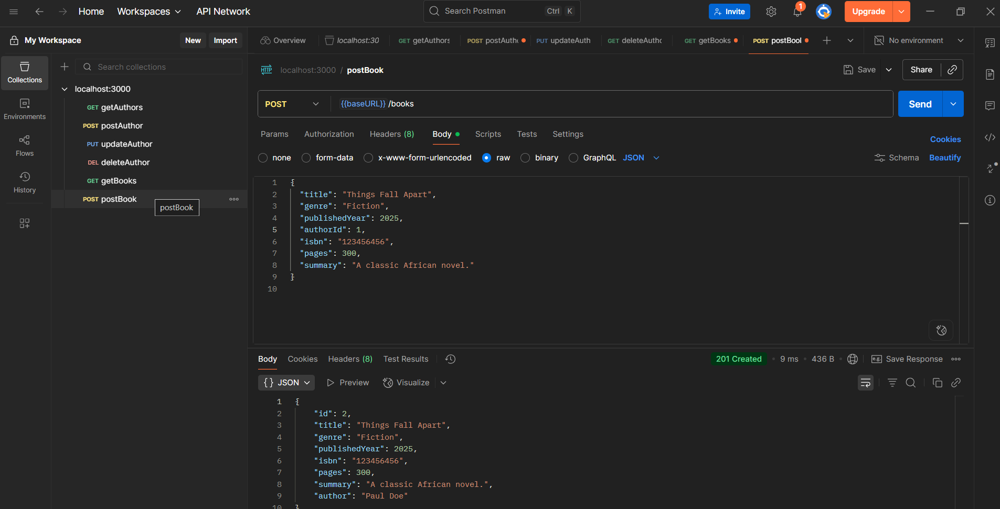


### Update book

`PUT /books/id`

**Request body:**

```json
{
  "title": "Why Me?",
  "genre": "Fiction",
  "publishedYear": 2025,
  "authorId": 1,
  "isbn": "123456456",
  "pages": 300,
  "summary": "A classic African novel."
}
```
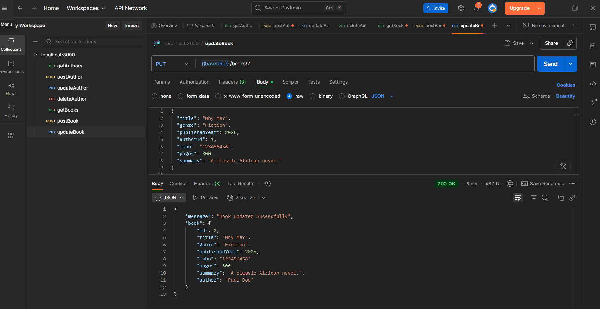


### Delete author

`DELETE /books/id`

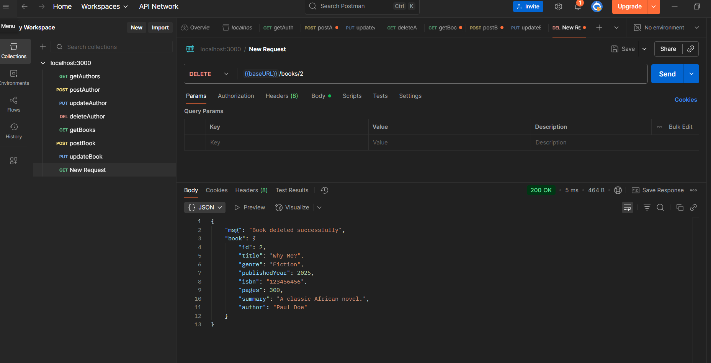


### Get books by author

`GET /authors/id/books`

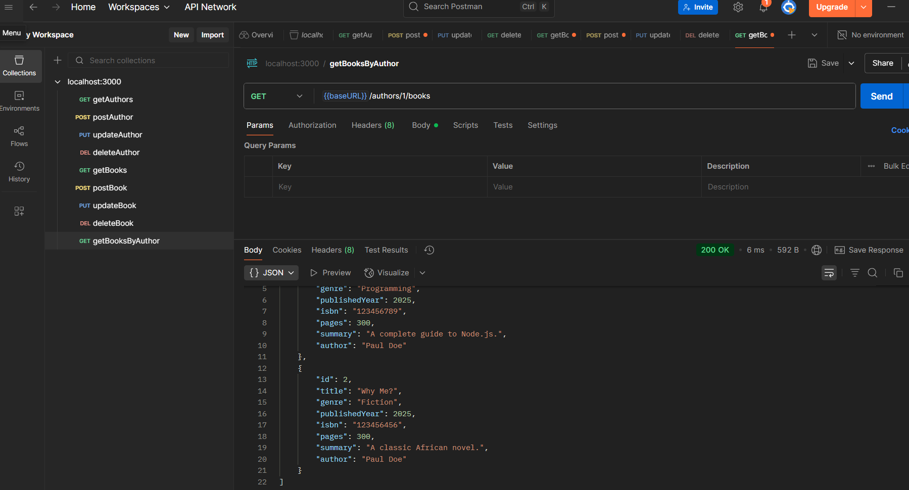


# Project Structure

    ```bash
    src/
    ├── controllers/   # Request handlers
        ├── author.ts  # Author Request handlers 
        └── book.ts    # Books Request handlers 
    ├── middleware/   # middleware handlers
        ├── errorMiddleware.ts      # error handler middleware
        ├── loggerMiddleware.ts     # logger middleware (Log request)
        └── validationMiddleware.ts   # validator middleware 
    ├── models/        # Data models
        ├── author.ts   # Author model
        └── book.ts     # Book model
    ├── routes/        # API routes
        ├── author.ts   # Authors router
        └── book.ts     # Books router
    └── server.ts       # App entry point
    ```

# Technologies

- Node.js
- TypeScript
- Express (Framework)
- Postman (for testing)

# License

MIT License © 2025 Karabo Kgaphola
